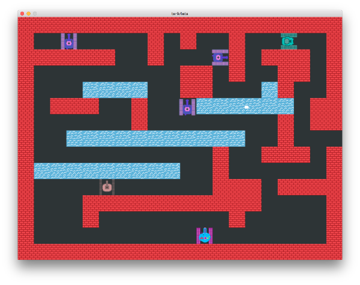

## tank4eta

A small BattleCity like game I am building for fun. It is written in Python 2. It should be easy to port it to python 3 at some point in the future.



### How to Run

**Option 1** - You can grab an already built binary from the GitHub's [release page](https://github.com/ironsmile/tank4eta/releases). But I am limited how many different targets I can support with builds.

**Option 2** - If your OS is not in the list you will have to run it from source. Luckily python is now ubiquitous and PyGame is a breeze to install via pip. First, make sure you have PyGame 1.* installed. The game can be started with `python app.py`. All assets you would need are included in the repo. In short, you have to run the following:

```
pip install pygame
git clone https://github.com/ironsmile/tank4eta.git
cd tank4eta
python app.py
```

### Controls

The game supports GamePads (or joysticks in PyGame parlance). If you do not have any, then the keyboard controls are:

* Player 1: movement with `up`, `down`, `left`, `right` and shoot with `space`.
* Player 2: movement with `w`, `a`, `s`, `d` and shoot with `t`

Unfortunatelly as of `v1.0.0` they cannot be rebinded.

### Mods: Your Own Maps

Everyone can create maps for the game. A map is just a text file with a name ending in `.map`. So, here is an example map:

```
wwwwwwwwwwwwwwwwwwww
w    e  w w  w  e  w
wwwwww  w e  w www w
w         ww w  ww w
w   ~~~~  ww   ~w  w
w www  w   ~~~~~~ ww
w      w e      w ww
w  ~~~~~~~~~~~     w
w           w  www w
w~~~~~~~~~  w      w
w           www wwww
w   wwwwwwwwwww    w
w   w        w     w
w     p    p       w
wwwwwwwwwwwwwwwwwwww
```

Every single character represents some object on the map. The game world is composed of rectangles and a character represents such a rectangle. New lines should be in unix format, that is to say just the newline character - `\n`. Here is a breakdown of the meaning of all characters:

* `p` - spot on which a player tank can spawn
* `e` - spot on which an enemy tank can spawn
* `w` - brick wall
* `~` - water
* ` ` _(space)_ - empty rectangle

Maps must be placed in `data/maps` directory and have a name like `my-new-level.map` so that the game would recognize and load them.

### Credits

In creating this I've used the following open parts:

* The [PyGame engine](http://www.pygame.org/)
* [Ubuntu font](https://design.ubuntu.com/font/)
* Scott Barlow's excellent [menu library](https://code.google.com/archive/p/python-pygame-menu-class/)

All the professional sounds in this game are the result of long and meticulous work by me and my closest people. So I am thankful for all the help I've received in this department!
